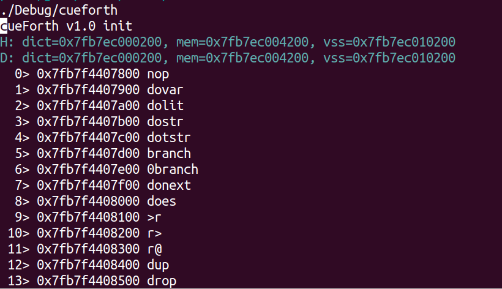
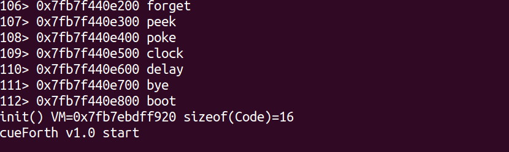
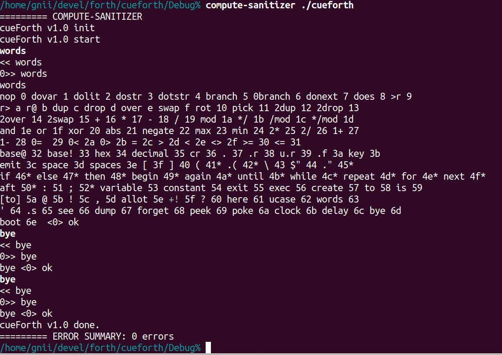
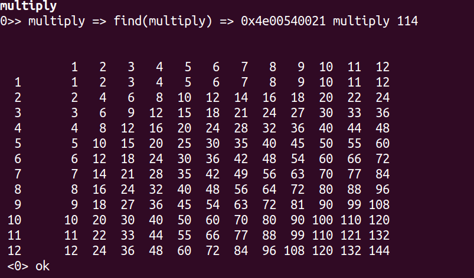

## tensorForth - eForth does tensor calculus, implemented in CUDA.
* Forth VM that supports tensor calculus and dynamic parallelism

### Status
* float  - Alpha
* tensor - planning
* gemm   - todo

### Why?
Compiled programs run fast on Linux. On the other hand, command-line interface and shell scripting tie them together. Productivity grows with this model especially for researchers.

For AI development today, we use Python mostly. To enable processing on CUDA device, say with Numba or the likes, mostly there will be 'just-in-time' compilations behind the scene then load and run. In a sense, the Python code behaves like a Makefile which requires compilers to be on the host box. At the tailend, to analyze, visualization can then be have. This is usually a long journey. After many coffee breaks, we update the Python and restart again. In order to catch progress, scanning the intermediate formatted files sometimes become necessary which probably reminisce the line-printer days for seasoned developers.

Having a 'shell' that can interactively and incrementally run 'compiled programs' from within GPU directly without dropping back to host system might be useful. Even though some might argue that the branch divergence could kill, but performance of the script itself is not the point. So, here we are!

### To build
* install CUDA 11.6 on your machine
* clone repo to your local directory

#### with Makefile, and test
* cd to your ten4 repo directory
* update root Makefile to your desired CUDA_ARCH, CUDA_CODE
* type 'make all'
* if all goes well, some warnings aside, cd to tests
* type 'ten4 < lesson_1.txt'

#### with Eclipse
* install Eclipse
* install CUDA SDK 11.6 for Eclipse (from Nvidia site)
* create project by importing from your local repo root
* exclude directories - ~/tests, ~/img
* set File=>Properties=>C/C++ Build=>Setting=>NVCC compiler
  + Dialect=C++14
  + CUDA=5.2 or above
  + Optimization=O3

### TODO
* add tensor object (study torch tensor, 128-bit NHWC tensor)
* integrate CUB, CUTLASS (utilities.init, gemm_api)
* formatted file IO (CSV, Numpy)
* preprocessor (DALI)
* ML cases and benchmark (kaggle.MNIST, ...)
* add inter-VM communication (CUDA stream)
* add dynamic graph (GNN)
* integrate plots (tensorboard, R)

### Progress
#### Initialization
|stage|snap|
|---|---|
|begin||
|end||

#### Outer Interpreter

#### Test - Dr. Ting's eForth lessons
|case#|ok|snap|
|---|---|---|
|repeat|pass||
|weather|pass||
|multiply|pass||
|calendar|pass||

