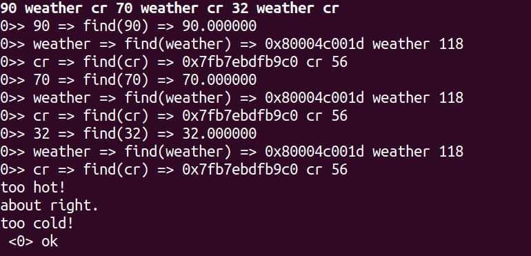
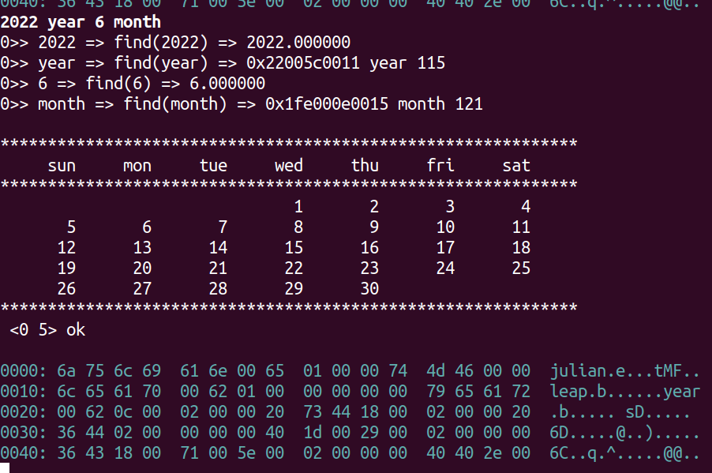

## cueForth - CUDA eForth
* Forth VMs that support dynamic parallelism

### Why?
Compiled programs run fast on Linux. On the other hand, command-line interface and shell scripting tie them together. Productivity grows with this model especially for researchers.

For AI development today, we use Python mostly. To enable processing on CUDA device, say with Numba or the likes, mostly there is 'compile on the fly' behind the scene then load and run. In a sense, the Python code behaves like a Makefile. To analyze, the formatted files usually become the focal point.

A 'shell' that can interactively and incrementally run 'compiled programs' from within GPU directly might become useful. Even though some might argue that the branch divergence could kill, but performance of the script itself is not the point. So, here we are!

### TODO
* add tensor object (study torch tensor)
* integrate CUTLASS

### Initialization
|stage|snap|
|---|---|
|begin||
|end||

### Outer Interpreter

### Test - Dr. Ting's eForth lessons
|case#|ok|snap|
|---|---|---|
|repeat|pass||
|weather|pass||
|multiply|pass||
|calendar|pass||

